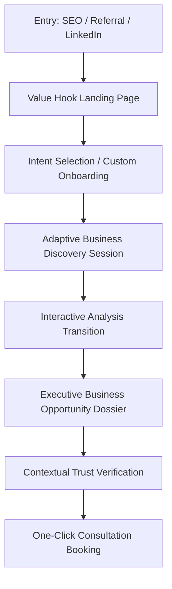
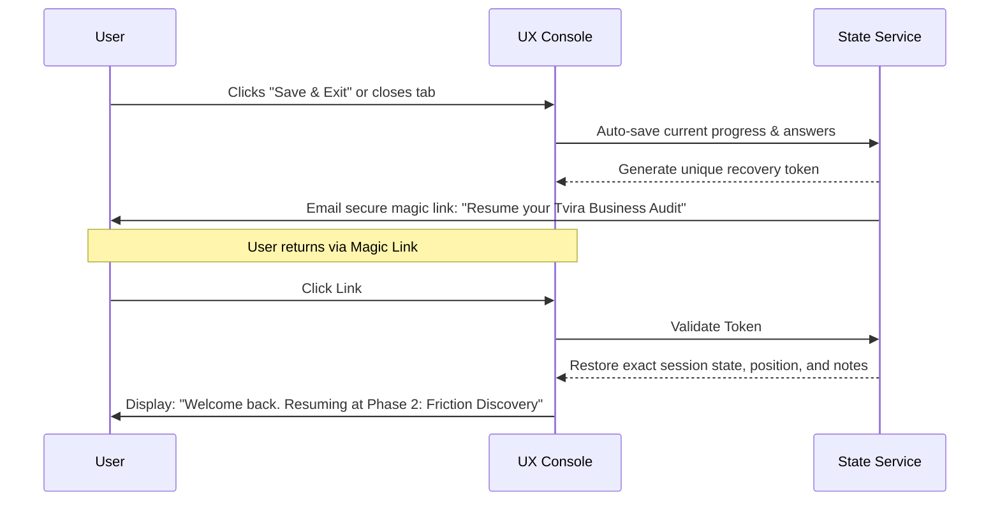
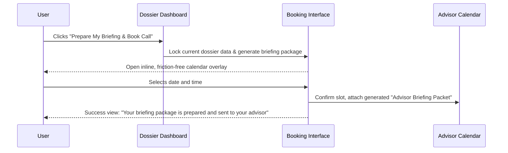

# TVIRA BUSINESS
## Product Experience Architecture & UX Design System
**Version:** 1.2 (Dossier Edition)  
**Role:** Principal Product Designer & UX Architect  
**Objective:** Define the complete user experience framework, interaction models, and brand personality for the Tvira Business platform before high-fidelity visual design and engineering commence.

---

## Executive Summary & Core Positioning

Tvira Business is an **AI-powered Business Discovery Platform**. It is not a chatbot, a simple form, or a generic SaaS dashboard. It is designed to act as an automated, elite strategic advisor that helps busy business owners audit their operations, identify bottlenecks, and discover actionable automation and AI integration opportunities.

Rather than delivering a generic, dry "consulting report," Tvira generates a **Business Opportunity Dossier**. The dossier frames findings not merely as static data points, but as a cohesive, narrative-driven story of the business—highlighting its operational context, frictions, and strategic potential.

---

## 1. User Journey Architecture

The Tvira user journey focuses on reducing friction for time-constrained business owners while establishing high credibility at every touchpoint.



### Journey Phases & UX Objectives

| Phase | User Motivation | Cognitive/UX Goal | Primary Drop-Off Risk | Risk Mitigation Strategy |
| :--- | :--- | :--- | :--- | :--- |
| **1. Landing & Hook** | Seeking ways to scale, reduce overhead, or automate repetitive tasks. | Establish immediate authority; promise a "15-minute diagnostic" rather than a sales pitch. | "This is just another AI wrapper or long marketing survey." | Focus on professional services typography. Show a preview of the high-value dossier output. |
| **2. Intent Selector** | Wants to address a specific pain point (e.g., support load, inventory delays). | Tailor the context immediately. Let the user drive the direction of the audit. | "This will ask irrelevant questions about parts of my business I don't care about." | Let them choose their audit focus: **Operations**, **Tech Stack**, or **Resource Constraints**. |
| **3. Discovery Session** | Wants a quick, painless way to describe their business. | Keep cognitive load low. Ask adaptive, progressive questions. | Survey fatigue (typically after 5-6 questions). | Use progress milestones (e.g., "Mapping Baseline") instead of percentages. Provide "Why we ask this" context cues. |
| **4. Analysis Transition** | Curious to see the results. | Build high perceived value. Avoid the feeling of a "cheap instant API call." | Confusion on why the analysis takes a few moments to compile. | Run a transparent processing sequence showing the actual backend auditing steps in real-time. |
| **5. Dossier Review** | Wants clear, actionable findings and ROI data. | Read the operational story of the business first, then review structured opportunities. | Information overload; complex charts that require deciphering. | Use a **Story-First** layout starting with a Business Narrative, followed by the Business Value vs. Implementation Effort matrix. |
| **6. Consultation Handshake** | Needs help implementing the recommended changes. | Transition naturally from reading to booking an expert advisory call. | "They are trying to hard-sell me services." | Frame the call as a "Custom Briefing Prep Session" where Tvira compiles the dossier details for the advisor. |

---

## 2. Information Architecture & Content Strategy

The Information Architecture is designed to prioritize the strategic narrative and business outcomes, allowing the user to drill down into technical details and action items at their own pace.

### Navigation Structure
```
[Global Header]
 ├── Tvira Business Logo (Navigates to active view: Session or Dossier)
 ├── Security & Privacy Status Badge (Encrypted Session Indicator)
 └── Action: [Save & Exit] (Saves draft state, triggers magic link delivery)

[Left Navigation Sidebar - Only visible in Dossier Mode]
 ├── Executive Summary & Quick Wins
 ├── Business Narrative (The Story)
 ├── Opportunity Matrix (Business Value vs. Effort)
 ├── Actionable Recommendations (Blueprints)
 ├── Audit Trail & Evidence
 └── Call to Action: [Request Advisory Briefing] (Primary Button)
```

### Primary Views & Screen Layout Hierarchy

#### A. The Value Hook Landing Screen
*   **Hero Message:** Editorial typography focusing on objective analysis (e.g., *"Audit your operational bottlenecks in 15 minutes. Discover where automation creates verified ROI."*).
*   **Sample Artifact Carousel:** A high-fidelity, interactive preview of a sample "Business Opportunity Dossier" so users see the exact premium output before committing time.
*   **Security & Privacy Commitment:** Clear, prominent statement: *"No data is shared with public AI models. All inputs are sandbox-isolated and protected under enterprise-grade encryption."*

#### B. Intent Selector Screen
*   **Focus Areas Grid:** 3 clear cards:
    1.  *Operational Overhead & Friction* (Reduce manual labor, copy-paste, double-entry).
    2.  *Tech Stack & Software Silos* (Integrate isolated tools, streamline data flows).
    3.  *Automation Potential* (Identify where LLMs or workflow automation add clear value).
*   **Input Helper:** A simple industry selector drop-down (e.g., B2B SaaS, E-Commerce, Professional Services) to customize the question vocabulary.

#### C. Discovery Console
*   **Split-Screen Layout:**
    *   *Left Panel (The Diagnostic Hub):* Houses the current question, context cards, and response options.
    *   *Right Panel (Live Consultation Notes):* A real-time, read-only summary displaying what Tvira has deduced so far (e.g., *"Identified Tooling: Salesforce, Slack. Estimated Bottleneck: Manual Lead Triage"*). This makes the system feel active and listening.

#### D. The Business Opportunity Dossier Dashboard
*   **Top Bar (Core Indicators):**
    *   *Operational Maturity Level* (Early Stage, Growth Stage, or Scaled Operations) - *Provides benchmark context without requiring raw comparative statistics.*
    *   *Hours Reclaimed* (Estimated weekly hours spent on manual work that can be automated).
    *   *Automation Potential* (Low, Medium, or High capacity to absorb workflow automation).
*   **Main Workspace:** Vertical story flow detailing the Quick Wins, Business Narrative, Opportunity Matrix, and Detailed Recommendations.

---

## 3. Discovery Experience Architecture

The Business Discovery Session must feel like an intake meeting with a senior consultant. It rejects generic textboxes and long form fields in favor of guided, highly structured choices.

### Discovery Phases & Milestone Tracking
Instead of a standard "Progress Bar" (e.g., 20%, 40%), we use **Contextual Milestones** that correspond to consulting phases:

```
[ Phase 1: Operational Baseline ] ──> [ Phase 2: Friction Discovery ] ──> [ Phase 3: Resource Constraints ]
```

*   **Phase 1: Operational Baseline (3 Questions):** Captures business size, main tools, and core workflows.
*   **Phase 2: Friction Discovery (4 Questions):** Asks where staff spend manual hours, which departments suffer from communication delays, and what processes represent critical bottlenecks.
*   **Phase 3: Resource Constraints (3 Questions):** Understands budget availability, developer resource access, and timeline targets.

---

## 4. Interaction Flow Design

### Flow 1: Save, Pause, and Resume Session
Busy business owners are frequently interrupted. The platform must allow pausing at any point with zero loss of state.



### Flow 2: Consultation Booking Handshake
The transition from reading the dossier to booking a consultation must feel high-value and integrated.



---

## 5. Analysis Experience

The period between **completing the discovery session** and **generating the dossier** is the critical moment where perceived value is created. We must avoid generic loaders and instead show the intelligence work happening under the hood.

### The Real-time Processing Pipeline
Instead of displaying a standard spinner, the UI transitions to a split-screen dark viewport that details the reasoning pipeline. A sequence of tasks is shown running sequentially, with checkmarks appearing as they finish. These are not fake animations; they represent the actual analytical passes run by the system:

```
[●] Analyzing operational structure against B2B SaaS benchmarks...
[○] Sizing constraint severity across 3 identified bottleneck areas...
[○] Evaluating feasibility for Customer Onboarding automation...
[○] Extracting high-value Quick Wins for immediate implementation...
[○] Synthesizing the Business Narrative and Opportunity Dossier...
```

---

## 6. Dossier Experience Architecture

The Business Opportunity Dossier is structured around **storytelling and immediate clarity first**. Instead of presenting a collection of disconnected metrics and cards, it guides the owner through executive summaries, quick wins, and the operational narrative of their business before presenting detailed recommendations.

```
+-----------------------------------------------------------------------------------+
|  TVIRA BUSINESS | Business Opportunity Dossier                                     |
+-----------------------------------------------------------------------------------+
|  [ EXECUTIVE SUMMARY ]                                                            |
|  "Your customer onboarding pipeline contains 14 hours of manual copy-paste drag   |
|   per week. By automating lead intake, you can reclaim $22,400 in yearly value."  |
|                                                                                   |
|  +-------------------------------+  +-------------------+  +-------------------+  |
|  | Maturity: Growth Stage        |  | Reclaimed: 14h/w  |  | Potential: High   |  |
|  +-------------------------------+  +-------------------+  +-------------------+  |
|                                                                                   |
|  +-----------------------------------------------------------------------------+  |
|  |  [ 3 QUICK WINS DETECTED ]                                                  |  |
|  |  • Automate customer lead intake                                            |  |
|  |  • Remove manual CRM data entry tasks                                       |  |
|  |  • Standardize client onboarding email flows                                |  |
|  |  [View Direct Action Steps]                                                 |  |
|  +-----------------------------------------------------------------------------+  |
+-----------------------------------------------------------------------------------+
|  [ BUSINESS NARRATIVE: THE STORY OF YOUR BUSINESS ]                               |
|  "Your business has successfully built demand, generating approximately 600       |
|   monthly inquiries. However, operational processes remain heavily dependent on   |
|   manual follow-up and fragmented communication workflows. As lead volume        |
|   increases, these bottlenecks will likely constrain future growth and place     |
|   additional pressure on staff resources."                                        |
+-----------------------------------------------------------------------------------+
|  [ INTERACTIVE OPPORTUNITY MATRIX (BUSINESS VALUE vs IMPLEMENTATION EFFORT) ]      |
|                                                                                   |
|         High |   (Quick Wins)            (Strategic Bets)                         |
|              |   * Automated Intake      * Custom ERP Sync                        |
|     BUSINESS |                                                                    |
|        VALUE |   (Tactical Tweaks)       (Long-Term Projects)                     |
|              |   * Email Template        * Legacy Migration                       |
|          Low |                                                                    |
|              +-----------------------------------------------                     |
|                       Low                      High                               |
|                               IMPLEMENTATION EFFORT                               |
+-----------------------------------------------------------------------------------+
|  [ DETAILED RECOMMENDATIONS ]                                                     |
|  +-----------------------------------------------------------------------------+  |
|  | RECOMMENDATION 1: AUTOMATE CUSTOMER LEAD INTAKE                             |  |
|  | - Constraint Severity: CRITICAL BOTTLENECK                                  |  |
|  | - Friction: Team manually parses emails and copies details to CRM.          |  |
|  | - Proposed Solution: Deploy secure webhook to extract structured email data.|  |
|  | - Time Saved: 8 hrs/week | Effort Level: Low                                |  |
|  | - Evidence: [View Diagnostic Data] | Why we recommend this: [Read Logic]    |  |
|  +-----------------------------------------------------------------------------+  |
+-----------------------------------------------------------------------------------+
```

### Dossier Hierarchy & Content Sections (The Story Flow)

1.  **Executive Summary & Quick Wins Summary:**
    *   *Core Indicators:* Large, elegant serif highlights for **Operational Maturity Level**, **Resource Drag**, and **Automation Potential**.
    *   *Quick Wins Block:* **3 Quick Wins Detected** (e.g., *• Automate lead intake, • Remove manual CRM entry, • Standardize onboarding workflow*). Placed at the very top of the dossier to drive immediate alignment and high-satisfaction outcomes for busy executives.
2.  **Business Narrative (The Story of Your Business):**
    *   A cohesive prose narrative explaining the relationship between business success, operational friction, and downstream constraints. 
    *   This section reads like a custom strategic assessment, describing *how* they arrived here and *what* will constrain growth if left unchecked.
3.  **Opportunity Matrix (Business Value vs. Implementation Effort):**
    *   An interactive 2x2 grid mapping recommendations.
    *   **Business Value** (Y-axis): Low to High.
    *   **Implementation Effort** (X-axis): Low to High.
    *   Hovering over any dot in the matrix highlights the corresponding detail card below, providing a seamless visual link.
4.  **Actionable Recommendations & Blueprints:**
    *   Detailed recommendation cards. Each card must define its **Constraint Severity** to address what is actively holding back the business.
    *   *Constraint Severity Classifications:*
        *   **Critical Bottleneck:** Restricts growth immediately; highest priority remediation.
        *   **Growth Constraint:** Will restrict scaling if lead volume or sales double.
        *   **Operational Drag:** Causes unnecessary staff overhead and time leaks.
        *   **Minor Friction:** Minor workflow inconveniences.
    *   Includes estimated hours saved, implementation effort, and why the recommendation was selected.
5.  **Evidence & Audit Trail:**
    *   The base of the report contains the data evidence. It displays the specific inputs and benchmarks that led to each conclusion (e.g., *"Calculated based on your response: 'Support team copies data between systems' and the average industry B2B support triage time of 9.2 minutes per ticket."*).

---

## 7. Trust & Credibility System

Business owners are highly skeptical of generic AI advice. The platform must provide absolute transparency to build trust.

*   **Explicit Audit Trail:** Every recommendation has an info-icon that links directly to the specific user input or industry benchmark used. Nothing is presented without a source link.
*   **The "Why This Failed" Risk Disclosure:** For every opportunity card, Tvira displays a "Risks & Implementation Constraints" note (e.g., *"Risk: If your customer data is not standardized in CRM fields, automation will have a high error rate."*).
*   **Security & Data Privacy Badging:** Throughout the dashboard, show clear, non-intrusive security badges (*"Data Sandbox-Isolated"*, *"Zero public training guarantee"*).
*   **No AI Hallucination Guarantee:** If Tvira does not have enough information to make a high-confidence recommendation, it does not guess. Instead, it displays: *"Insufficient Data to Map Inventory Workflows. Let's discuss this on your briefing call to map it manually."*

---

## 8. Consultation Conversion Experience

Booking a consultation must feel like a premium upgrade that saves the user time, not a marketing funnel trying to sell them services.

*   **The "Advisor Briefing Packet" Concept:**
    *   Instead of asking the user to book a call to "learn more," the CTA is framed as: **"Prepare My Briefing & Consult an Expert."**
    *   The interface shows a visual layout of the PDF briefing packet that will be compiled and automatically sent to the human advisor. This communicates that the advisor will arrive at the call fully informed about the user's business.
*   **Contextual Placement:**
    *   The primary booking widget is permanently pinned as a floating sidebar or dedicated section at the end of the dossier.
    *   Contextual booking links are also embedded inside high-effort Recommendations (e.g., *"This recommendation requires a custom database sync. Book a 15-minute technical briefing to review the architecture."*).
*   **Zero-Friction Scheduling:**
    *   The calendar is embedded directly in the dossier view. The user does not need to leave the page, open a new tab, or re-enter their email and company details.
    *   The calendar automatically maps their timezone and highlights 3 recommended "express slots" (e.g., *"Next Available: Today at 3:00 PM"*).

---

## 9. Mobile Experience Strategy

Business owners frequently consume reports on their mobile devices (e.g., while traveling or between meetings). The mobile layout must adapt to deliver quick strategic insights without clutter.

*   **Responsive Adaptation Grid:**

| Feature / UI Block | Desktop Layout | Mobile Layout (Adaptive Behavior) |
| :--- | :--- | :--- |
| **Discovery Session** | Split-screen (Intake / Live Notes) | Single column. Live Notes panel is minimized to a floating pill: *"View Live Notes"* that opens a slide-up drawer. |
| **Opportunity Matrix** | Interactive 2x2 grid | Transformed into a swipeable carousel of cards filtered by "Quick Wins" first. The visual grid is replaced by a simplified list view. |
| **Detailed Opportunities** | Expanded double-column cards | Collapsible accordions with high-level headers showing: **Opportunity** \| **Constraint Severity** \| **Effort**. Tapping expands the full description. |
| **Consultation Widget** | Fixed right-hand sidebar panel | Sticky bottom sheet with a single button: *"Request Briefing Call"* that slides up the calendar when tapped. |

*   **Mobile Reading Optimization:**
    *   High-contrast typography to ensure readability on the go.
    *   A one-tap "Email PDF Summary" button located at the top of the mobile screen, allowing the user to easily send the dossier to their desktop for deep review.

---

## 10. Design System Philosophy & Tone of Voice

Tvira Business must project the visual authority and objective tone of a premium professional services firm (e.g., McKinsey, Goldman Sachs, or Stripe).

```
+-----------------------------------------------------------------------------------+
|  BRAND PERSONALITY SPECTRUM                                                       |
|                                                                                   |
|  Informal/Hype  [-----------------------------------------------------*]  Formal  |
|  Generic AI     [-----------------------------------------------------*]  Elite   |
|  Complex UI     [---*--------------------------------------------------]  Simple  |
|  Futuristic     [-----------------------------------------------------*]  Classic |
+-----------------------------------------------------------------------------------+
```

### Visual Tone & Brand Mood

*   **Professional Services Persona:** Avoid flashy glowing neon gradients, dark futuristic cyber-punk grids, and generic floating chatbot windows. The visual language should use clean layouts, generous whitespace, sharp editorial borders, and high-quality muted, natural tones (e.g., warm grays, deep forest green accents, and charcoal typography).
*   **Typography System:**
    *   *Headings:* A highly legible, premium editorial serif (e.g., *Lora*, *Playfair Display*, or *Outfit*) to convey wisdom, intelligence, and structure.
    *   *Body & Data:* A crisp, geometric sans-serif (e.g., *Inter* or *Roboto*) for numbers, metrics, labels, and micro-copy, ensuring ease of reading.
*   **Tone of Voice (Copywriting Guidelines):**
    *   *Diagnostic and Objective:* Speak in clear, professional sentences. Do not use exclamation points, marketing buzzwords (e.g., *"revolutionary AI"*), or casual slang.
    *   *Action-Oriented:* Frame copy around outcomes (e.g., *"Reduce data silos"* instead of *"Improve your setup"*).
*   **Motion and Interaction Principles:**
    *   *Structured Transitions:* Views should not fade or bounce in a playful way. Use swift, slide-in transitions that feel like pages of a high-quality physical dossier sliding across a desk.
    *   *Micro-feedback:* Buttons and selectable cards should have crisp, subtle borders that darken on hover, providing instant tactile feedback.

---

## Conclusion & Next Steps for Figma Designers

This Product Experience Architecture defines how the product works, flows, and speaks. When translating this document into high-fidelity Figma layouts:

1.  **Prioritize Editorial Layouts:** Use grid alignments that feel like a premium financial dossier or publication.
2.  **Focus on the Transition States:** Ensure the "Analysis Processing" screen is designed as a highlight interaction that builds anticipation and trust.
3.  **Embed the Trust Mechanisms:** Make sure trace links, security indicators, and risk disclosures are styled to look helpful, clear, and integral to the layout rather than secondary footnotes.
